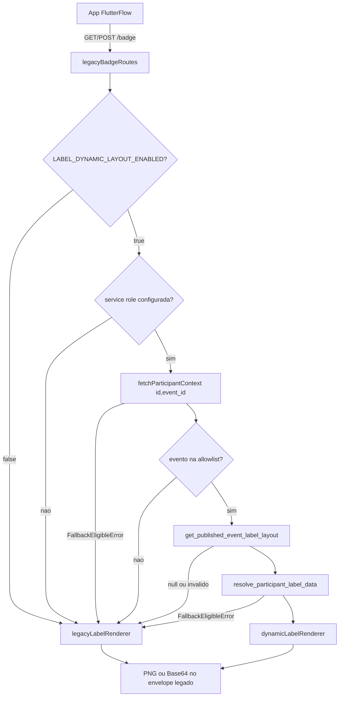

# Plano operacional — Motor dinâmico de etiquetas (Fase 3, `creator-label`)

**Projeto:** `web-dks/creator-label`
**Fase:** Implementação 3
**Depende de:** Fases 1–2 concluídas no `sistema-credenciamento-dks` (confirmado nesta seção)
**Status:** Aprovado para implementação task por task, com os ajustes descritos na seção 3

---

## 1. Objetivo

Evoluir o `creator-label` de monólito hardcoded (`index.js`) para um motor que renderiza o **layout publicado de cada evento**, sem alterar o aplicativo FlutterFlow, o fluxo Bluetooth, o contrato `GET|POST /badge`, o envelope Base64 nem o banco/RPCs do sistema de credenciamento.

Fora deste plano: Fases 1–2 (já entregues), Fase 4 (homologação física completa), `/v2/badges/preview`, edição de layout.

---

## 2. Confirmação no Supabase (read-only, feita antes de codificar)

Consulta feita no projeto `credenciamento` (somente leitura, sem escrita):

### 2.1 Assinaturas das RPCs

| Função | Args | Retorno | `SECURITY DEFINER` |
|---|---|---|---|
| `get_published_event_label_layout` | `p_event_id bigint` | `jsonb` | Sim |
| `resolve_participant_label_data` | `p_participant_id uuid, p_event_id bigint` | `jsonb` | Sim |

### 2.2 Formato real do retorno de `get_published_event_label_layout(event_id)`

Confirmado com layout publicado do evento de homologação (`event_id = 6`, `version_id = 16`, `version_number = 3`):

```json
{
  "version_id": 16,
  "template_id": 6,
  "version_number": 3,
  "layout_config": {
    "schemaVersion": 1,
    "orientation": "landscape",
    "virtualWidth": 800,
    "virtualHeight": 500,
    "backgroundColor": "#FFFFFF",
    "elements": [
      { "id": "el-name", "type": "text", "dataSource": "participant.name", "...": "..." },
      { "id": "el-custom", "type": "text", "dataSource": "custom_field.91", "...": "..." },
      { "id": "el-qr", "type": "qr_code", "dataSource": "participant.id", "...": "..." },
      { "id": "el-logo", "type": "image", "dataSource": "event.label_logo", "...": "..." }
    ]
  },
  "print_profile": {
    "id": 1,
    "code": "dks_80x50_300_landscape",
    "name": "DKS padrão — 80 x 50 mm — 300 DPI",
    "width_mm": 80,
    "height_mm": 50,
    "dpi": 300,
    "default_format": "base64",
    "default_rotation": 0,
    "supported_rotations": [0],
    "safe_margin_top": 0,
    "safe_margin_left": 0,
    "safe_margin_right": 0,
    "safe_margin_bottom": 0
  }
}
```

**Achado importante (ajusta a Spec 03 atualizada):** a RPC **não** devolve só `layout_config` — devolve um envelope com `version_id`, `template_id`, `version_number`, `layout_config` e `print_profile`. O `layoutService` deve:

- ler `virtualWidth/virtualHeight/schemaVersion/elements` de dentro de `layout_config` (não do topo);
- ler dimensão física/DPI/rotação de `print_profile`, **validando contra limites seguros conhecidos** (ver §3.6 do checklist de segurança) em vez de assumir cegamente 80×50/300/0 — se `print_profile` vier fora do perfil homologado (`dks_80x50_300_landscape`, 80×50 mm, 300 DPI, rotação 0), tratar como layout inválido → fallback legado;
- guardar `version_id` no cache (ver ajuste 6).

### 2.3 Formato real do retorno de `resolve_participant_label_data(participant_id, event_id)`

```json
{
  "event": {
    "id": 6,
    "name": "string",
    "venue": "string",
    "city": "string",
    "state": "string",
    "label_logo": "https://<host>.supabase.co/storage/v1/object/public/eventos/photos/<event_id>/<arquivo>.png"
  },
  "participant": {
    "id": "uuid",
    "name": "string",
    "category": "string"
  },
  "customFields": {
    "91": "valor ou ausente quando não respondido"
  }
}
```

`customFields` pode vir `{}` (vazio) quando o participante não respondeu o campo — o renderer de texto deve tratar isso como campo ausente e aplicar `fallbackValue`.

### 2.4 Host de logo observado

`label_logo` aponta para Supabase Storage público do próprio projeto de credenciamento (`https://<project-ref>.supabase.co/storage/v1/object/public/eventos/...`). Esse host é o candidato natural para `LABEL_LOGO_ALLOWED_HOSTS` por padrão, mantendo a variável configurável para outros ambientes.

### 2.5 Evento(s) de homologação candidatos

`event_id = 6` (versão publicada `16`, 4 elementos: nome, custom field, QR, logo) e `event_id = 33` (versão publicada `19`, 2 elementos de texto). Ambos servem como fixtures para os testes do dinâmico — **os dados usados nos testes automatizados não devem ler o Supabase real** (ver ajuste 3); os JSONs de `layout_config` acima são copiados como fixtures estáticas em `tests/fixtures/`.

### 2.6 Gate de dependência

Fases 1–2 confirmadas completas no ambiente-alvo (tabelas `event_label_*`, RPCs allowlisted, editor publicando versões). **Pode prosseguir.**

---

## 3. Ajustes obrigatórios incorporados a este plano

Estes 10 ajustes têm prioridade sobre qualquer redação divergente na Spec 03 atualizada ou no plano-base; onde houver conflito, este documento prevalece.

### 3.1 Runner de testes exclusivo: `node:test` + `node:assert`

- Nenhuma dependência de teste externa (sem Jest, Mocha, Vitest, Chai, Sinon).
- Scripts em `package.json`:

```json
{
  "scripts": {
    "test": "node --test tests/",
    "test:golden": "node --test tests/golden/"
  }
}
```

- Mocks/stubs feitos manualmente (fakes de repositório — ver 3.3), sem biblioteca de mock.
- Helpers de asserção compostos a partir de `node:assert/strict` em `tests/helpers/`.

### 3.2 `package-lock.json` versionado e congelamento de versões antes do baseline

Antes de capturar os golden tests (Task 1):

1. Remover `package-lock.json` do `.gitignore` (mantém-se ignorado apenas `node_modules/`).
2. Fixar versões exatas (sem `^`) das dependências que afetam pixel/fonte no `package.json`:
   - `@napi-rs/canvas`: `0.1.100` (versão instalada e usada na auditoria AS-IS).
   - `qrcode`: `1.5.4`.
   - `express`: `4.22.2`.
   - `@supabase/supabase-js`: `2.111.0`.
   - `dotenv`: `17.4.2`.
3. Rodar `npm install` para gerar `package-lock.json` com essas versões exatas e commitar o arquivo.
4. Declarar `engines.node` em `package.json` fixando a versão usada na captura: `"node": "22.14.0"`.
5. Registrar o SHA-256 do arquivo de fonte `arial.ttf` (bundlado na raiz) no próprio relatório de baseline (Task 1), pois qualquer troca de fonte altera pixels:

   ```
   arial.ttf → sha256 = c9b76220a5be42ead4733611e417cd65c5fd8aeaa33eb56576ac378a37d130a
   ```

6. Documentar essas três âncoras (Node, `@napi-rs/canvas`, fonte) no cabeçalho do relatório de baseline (Task 1) e no `README.md` (Task 2) como pré-requisito para reproduzir o baseline.

### 3.3 Golden tests com fixtures locais e repositórios fake (sem Supabase real)

- `tests/fixtures/participants.json` — objetos sintéticos (`id`, `name`, `extra_answers`) cobrindo nome curto/médio/longo/duas linhas/regra CPS/sem QR.
- `tests/fixtures/label-layouts/*.json` — cópias estáticas dos `layout_config`/`print_profile` reais capturados em §2.2 (sem dado pessoal, `participant.name` substituído por valor sintético nos fixtures de dados).
- `tests/fakes/participantRepositoryFake.js`, `tests/fakes/labelRpcRepositoryFake.js` — implementam a mesma interface dos repositórios reais, retornando fixtures em memória; usados via injeção de dependência (nunca via variável de ambiente apontando para o Supabase real).
- Nenhum teste (golden, unitário ou de contrato) pode exigir `.env` com credenciais reais para passar. `npm test` deve rodar totalmente offline.
- Testes de integração opcionais com Supabase real (se algum dia existirem) ficam fora de `npm test`, em script separado não incluído no gate de CI/commit.

### 3.4 Comparação de golden: SHA-256 primeiro, pixels RGBA depois, sem auto-aprovação

`scripts/compare-golden.js`:

1. Gera o PNG a partir do fixture.
2. Calcula SHA-256 do buffer PNG e compara com o hash gravado em `golden/manifest.json`.
3. Se os hashes baterem → `PASS` imediato (idêntico byte a byte).
4. Se os hashes não baterem → decodifica ambos os PNGs (buffer atual vs. arquivo em `golden/*.png`) e compara pixel a pixel (RGBA) com `@napi-rs/canvas.decode` (ou `loadImage` + leitura de `ImageData`), calculando: nº de pixels diferentes, diferença máxima por canal, diferença média.
5. **Nunca aprova automaticamente** — qualquer diferença de pixel (mesmo 1 pixel) marca o teste como `FAIL` e imprime um relatório (`golden/diff-report/<caso>.json` + PNG de diff opcional). Atualizar `golden/manifest.json` só é permitido via `npm run golden:update`, script manual e explícito, nunca disparado pelo `npm test`.
6. `npm test` (incluindo `test:golden`) precisa terminar com todos os hashes idênticos para ser considerado verde nos gates deste plano.

### 3.5 Taxonomia de erros — só falhas elegíveis ativam fallback legado

Arquivo `src/utils/errors.js` define duas famílias:

```text
FallbackEligibleError (extends Error)
├── ParticipantContextNotFoundError   // participante inexistente na consulta mínima
├── EventIdMissingError               // event_id nulo
├── EventNotAllowlistedError          // evento fora de LABEL_DYNAMIC_EVENT_IDS
├── LayoutNotPublishedError           // RPC de layout retornou null
├── LayoutInvalidError                // schema/print_profile fora do contrato
├── LabelDataUnavailableError         // resolve_participant_label_data falhou/null
├── SupabaseTimeoutError              // qualquer operação Supabase estourou 2s (ajuste 7)
└── SupabaseUnavailableError          // erro de rede/serviço do Supabase

NonFallbackError (extends Error)      // resulta em resposta de erro própria, NUNCA em fallback silencioso
├── InvalidRequestError        (400)  // payload malformado, name ausente sem fallback possível
├── PayloadTooLargeError       (413)
├── UnauthorizedError          (401)  // rota v2 sem/inválido Bearer
├── ForbiddenError             (403)
├── RateLimitedError           (429)
├── ConcurrencyLimitExceededError (503)
└── LogoFetchError                    // NÃO é fallback total: apenas omite o elemento de imagem (ver Task 7)
```

Regra central: `badgeService` só troca para `legacyLabelRenderer` quando o erro capturado é instância de `FallbackEligibleError` (ou quando a feature flag/service role/allowlist já direcionam para o legado antes de qualquer chamada). Qualquer `NonFallbackError` propaga como resposta HTTP própria (400/401/403/413/429/503), nunca cai em silêncio no legado. `LogoFetchError` é tratada dentro do próprio `dynamicLabelRenderer`/`imageService` (omite o elemento + log de warning) e não sobe como erro de rota.

### 3.6 Cache `participant_id → event_id` e `event_id → layout publicado` com `version_id`

- `src/utils/cache.js`: cache TTL em memória (Map + timestamp), sem dependência externa.
- Chave 1: `participantId` → `{ event_id, cachedAt }`, TTL curto (default 60s, configurável).
- Chave 2: `event_id` → `{ version_id, template_id, version_number, layout_config, print_profile, cachedAt }`, TTL 30–120s (default 60s, configurável via `LABEL_LAYOUT_CACHE_TTL_SECONDS`).
- O `version_id` **sempre viaja dentro da entrada de cache do layout** (nunca cacheado separadamente), para permitir invalidação/observabilidade por versão e evitar servir `layout_config` de uma versão com `version_id` de outra.
- Nenhum dado pessoal (`name`, `extra_answers`, `customFields`) é cacheado — apenas `event_id`/metadados de layout.
- Cache é somente em memória do processo (sem Redis nesta fase); reinício do processo limpa o cache.

### 3.7 Timeout de 2s por operação Supabase + orçamento total ~5s por requisição

- `src/repositories/*`: cada chamada (`fetchParticipantContext`, `getPublishedLayout`, `resolveParticipantLabelData`, `fetchLegacyParticipant`) é envolvida em `Promise.race` com timeout de 2000ms; estourar o timeout lança `SupabaseTimeoutError` (fallback elegível).
- `src/services/badgeService.js`: mede o tempo total decorrido desde o início do fluxo dinâmico; se o orçamento total (~5000ms, configurável via constante interna) for excedido antes de finalizar a renderização dinâmica, aborta o restante do fluxo dinâmico e cai no legado (mesma regra de `FallbackEligibleError`), evitando que a soma de múltiplas chamadas de 2s cada estoure o tempo de resposta ao aplicativo.
- Logar `duration_ms` por etapa (contexto, layout, dados, render) para observabilidade (sem PII).

### 3.8 Endurecimento do `imageService` contra SSRF e conteúdo malicioso

Ao buscar `event.label_logo`, o `imageService` deve, nesta ordem:

1. Rejeitar qualquer URL que não seja `https://`.
2. Resolver o host contra `LABEL_LOGO_ALLOWED_HOSTS` (allowlist explícita); se vazio, usar apenas o host de Storage do próprio Supabase configurado (`SUPABASE_URL`).
3. Resolver o DNS do host e validar que **nenhum** IP resolvido é privado/reservado/loopback (`10.0.0.0/8`, `172.16.0.0/12`, `192.168.0.0/16`, `127.0.0.0/8`, `169.254.0.0/16`, `::1`, `fc00::/7`, `fe80::/10`) — bloqueia SSRF por DNS rebinding.
4. Fazer a requisição com `redirect: 'manual'`; se a resposta for redirect, validar o novo destino contra os mesmos passos 1–3 antes de seguir manualmente (máximo 1 redirect); redirect para host fora da allowlist é rejeitado.
5. Aplicar timeout de 2s na requisição (reaproveita o mecanismo do ajuste 7).
6. Impor limite de 2 MB via checagem incremental do corpo (abortar assim que o total lido ultrapassar o limite, não confiar apenas em `Content-Length`).
7. Validar `Content-Type` **e** os magic bytes do corpo (assinatura binária PNG/JPEG/WebP) — rejeitar se o tipo declarado não bater com o conteúdo real (MIME falso).
8. Decodificar a imagem e validar dimensões máximas (ex.: recusar acima de 4000×4000 px) antes de desenhar no canvas, evitando decode bombs.
9. Qualquer falha nos passos acima gera `LogoFetchError` → **não é fallback total**: o elemento de imagem é omitido, um warning sanitizado é logado, e a etiqueta continua a ser renderizada sem a logo (conforme já definido na Spec 03 atualizada §15).

### 3.9 Rate limit e concorrência configuráveis por ambiente

- Variáveis novas: `LABEL_RATE_LIMIT_WINDOW_MS`, `LABEL_RATE_LIMIT_MAX`, `LABEL_CONCURRENCY_LIMIT`, todas lidas por ambiente (`NODE_ENV` ou `APP_ENV`).
- Defaults propostos (ajustáveis via env, nunca hardcoded sem override):

  | Ambiente | Janela | Máx. requisições/IP | Concorrência global |
  |---|---|---|---|
  | `development` | 60s | 300 | 20 |
  | `staging` | 60s | 300 | 20 |
  | `production` | 60s | 600 | 40 |

- Justificativa do default de produção ser generoso por IP: em eventos presenciais, múltiplos totens/impressoras/dispositivos da equipe costumam sair do mesmo IP/NAT do local do evento; um limite agressivo por IP derrubaria todos os dispositivos legítimos simultaneamente. O controle real de abuso fica a cargo do limite de **concorrência global** (`LABEL_CONCURRENCY_LIMIT`) e do rate limit generoso por IP, não de bloqueio agressivo por IP.
- Rate limit aplica-se à rota legada `/badge` (sem exigir novo header no app) e à rota `/v2/badges/render` (além da autenticação Bearer).
- Limite de concorrência implementado como semáforo simples em `src/utils/concurrency.js` (contador global de renders ativos); requisição além do limite retorna `ConcurrencyLimitExceededError` (503) — não é fallback, é proteção de CPU.

### 3.10 Deploy inicial obrigatório com `LABEL_DYNAMIC_LAYOUT_ENABLED=false`

- `.env.example` e `render.yaml` trazem `LABEL_DYNAMIC_LAYOUT_ENABLED=false` como valor padrão documentado.
- Task 10 (validação/deploy) só é considerada concluída com o serviço publicado em produção com a flag desligada e o contrato legado validado.
- A ativação do primeiro evento em produção (mudar a flag/allowlist em produção) **não faz parte da execução automática deste plano** — exige nova aprovação humana explícita, conforme gate obrigatório definido pelo usuário.

---

## 4. Fluxo alvo (`/badge`)



Pseudocódigo (`badgeService.orchestrate`):

```text
params = parseParams(req)                          // compatível, sem mudanças de contrato
se !LABEL_DYNAMIC_LAYOUT_ENABLED ou !serviceRoleConfigurada:
    retornar renderComLegado(params)
se params.qr nao e UUID valido:
    retornar renderComLegado(params)                // comportamento atual preservado

tentar (com orcamento total ~5s):
    ctx = fetchParticipantContext(params.qr)         // timeout 2s, cache participant_id->event_id
    se allowlist preenchida e ctx.event_id fora dela:
        lancar EventNotAllowlistedError
    layout = getPublishedLayout(ctx.event_id)        // timeout 2s, cache event_id->layout com version_id
    validarContratoLayout(layout)                    // print_profile + schema + limites
    data = resolveParticipantLabelData(params.qr, ctx.event_id)  // timeout 2s
    png = dynamicLabelRenderer.render(layout, data, params)
    retornar envelopeLegado(png, params.outputFormat)
capturar FallbackEligibleError:
    retornar renderComLegado(params)
capturar NonFallbackError:
    retornar respostaDeErroPropria(erro)             // 400/401/403/413/429/503, nunca fallback
```

---

## 5. Mapa de arquivos

```text
index.js                         → thin entry: require('./src/server')
src/server.js                    → listen(PORT)
src/app.js                       → express + middleware + rotas
src/config/env.js                → env tipado + flags + defaults por ambiente
src/config/constants.js          → mm, dpi, virtual sizes, limites, timeouts, IP ranges privados
src/routes/legacyBadgeRoutes.js
src/routes/badgeV2Routes.js
src/routes/healthRoutes.js
src/controllers/legacyBadgeController.js
src/controllers/badgeV2Controller.js
src/services/badgeService.js     → orquestra dinâmico vs legado + orçamento de tempo total
src/services/layoutService.js    → cache + validação de layout
src/services/imageService.js     → fetch seguro de logo (SSRF, redirects, MIME, tamanho, dimensões)
src/repositories/participantRepository.js  → fetchParticipantContext + fetchLegacyParticipant (com timeout)
src/repositories/labelRpcRepository.js     → RPCs (com timeout)
src/renderers/legacyLabelRenderer.js       → extrair renderBadgePng atual (pixel-idêntico)
src/renderers/dynamicLabelRenderer.js
src/renderers/textRenderer.js
src/renderers/qrRenderer.js
src/renderers/imageRenderer.js
src/validators/requestValidator.js
src/validators/layoutContractValidator.js
src/utils/logger.js | errors.js | cache.js | timingSafeEqual.js | concurrency.js
tests/                           → node:test, fixtures/, fakes/, golden/
golden/                          → manifest.json (SHA-256) + PNGs de referência
scripts/capture-golden.js
scripts/compare-golden.js
docs/plano-motor-dinamico-etiquetas.md      (este arquivo)
docs/validacao-motor-dinamico-etiquetas.md  (Task 10)
README.md .env.example render.yaml
```

---

## 6. Contrato legado exato (preservar bit a bit)

- Rotas: `GET /badge`, `POST /badge`.
- Parâmetros aceitos e aliases: `name`, `qr`, `dpi`, `rotation`/`rotate`, `format`, `maxLine1`/`max_line1`/`maxcharsline1`, `maxLine2`/`max_line2`/`maxcharsline2`.
- PNG: `Content-Type: image/png`, `Content-Disposition: inline; filename="badge.png"`.
- Base64: `{ success: true, format: 'base64', data, dataUri, mimeType: 'image/png' }` — chaves e valores exatamente nessa forma.
- Nome ausente → 400 `{ error: 'Missing required parameter: name' }`.
- Erro interno → 500 `{ error: 'Internal Server Error' }`.
- Comportamento de participante inexistente preservado: QR omitido quando Supabase legado não encontra o participante; `name` do request ainda gera etiqueta.

---

## 7. Estratégia de fallback (resumo)

Ver taxonomia completa em §3.5. Resumo das condições que levam ao legado:

- feature flag desligada;
- service role ausente;
- `qr` não é UUID válido;
- contexto do participante não encontrado / `event_id` nulo;
- evento fora da allowlist piloto;
- layout não publicado ou inválido (schema ou `print_profile` fora do perfil homologado);
- RPC de dados indisponível/timeout;
- qualquer timeout Supabase (2s por operação) ou estouro do orçamento total (~5s).

Não levam a fallback (respondem com erro próprio): payload excessivo, formato malicioso, autenticação inválida na rota v2, rate limit, limite de concorrência, falha isolada de logo (que apenas omite o elemento).

---

## 8. Rollout e gates (pós-implementação)

1. Deploy com `LABEL_DYNAMIC_LAYOUT_ENABLED=false` (obrigatório, ajuste 10) → validar `/badge` legado + golden.
2. **Nova aprovação humana obrigatória** antes de habilitar qualquer evento em `LABEL_DYNAMIC_EVENT_IDS` em produção.
3. Habilitar 1 evento de homologação (candidato: `event_id = 6` ou `33`, confirmados em §2.5).
4. Comparar imagens dinâmico vs. esperado do editor.
5. Testar aplicativo via Bluetooth (fora do escopo de código deste plano — depende do time de campo).
6. Expandir allowlist gradualmente; só então lista vazia (todos com layout publicado).

### Gates obrigatórios desta execução

- Após capturar o baseline (Task 1): apresentar os hashes SHA-256 de cada golden.
- Após modularizar (Task 3): provar que todos os golden tests continuam idênticos (mesmos hashes).
- Após implementar o dinâmico (Tasks 5–9): apresentar os testes (suite completa) antes de qualquer deploy.
- Deploy somente com a feature flag desligada.
- Ativação do primeiro evento em produção exige nova aprovação humana explícita (não incluída neste plano de implementação).

---

## 9. Não alterar (restrições absolutas)

- Aplicativo FlutterFlow.
- Fluxo Bluetooth.
- Contrato `GET/POST /badge`.
- Envelope Base64 (`success`, `format`, `data`, `dataUri`, `mimeType`).
- Comportamento do renderer legado antes de capturar o baseline (Task 1 vem sempre antes de qualquer refatoração em `index.js`).
- Banco de dados ou RPCs do sistema de credenciamento (leitura apenas; nenhuma migração criada a partir do `creator-label`).

---

## 10. Critérios de aceite

Mantidos integralmente os critérios da Spec 03 atualizada §26, acrescidos de:

- [ ] `package-lock.json` versionado com versões congeladas de Node/`@napi-rs/canvas`/fonte antes do baseline.
- [ ] 100% dos testes rodando via `node --test`, sem dependências externas de teste.
- [ ] Golden tests offline (fixtures + fakes), sem chamadas ao Supabase real.
- [ ] Comparação de golden por SHA-256 e, se necessário, RGBA, sem auto-aprovação de diffs.
- [ ] Taxonomia de erros implementada; apenas `FallbackEligibleError` aciona o legado.
- [ ] Cache `participant_id→event_id` e `event_id→layout` com `version_id` embutido.
- [ ] Timeout de 2s por operação Supabase e orçamento total ~5s por requisição.
- [ ] `imageService` endurecido contra SSRF, redirect, IP privado, MIME falso, tamanho e dimensões.
- [ ] Rate limit e concorrência configuráveis por ambiente, com defaults tolerantes a IP compartilhado.
- [ ] Deploy inicial em produção com `LABEL_DYNAMIC_LAYOUT_ENABLED=false`.
